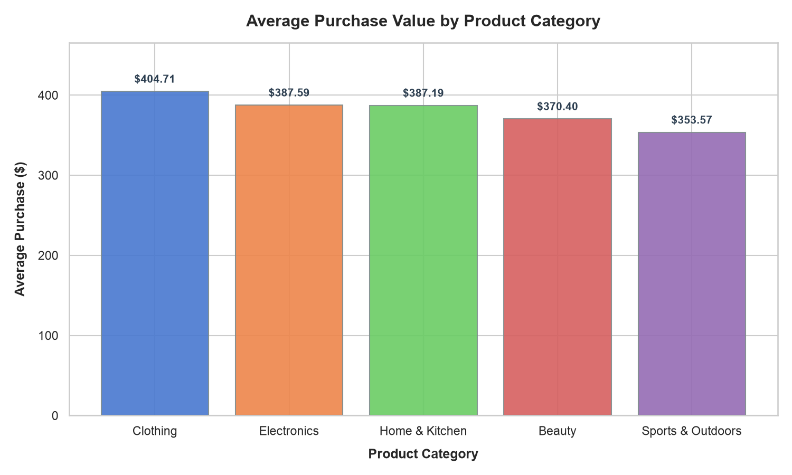
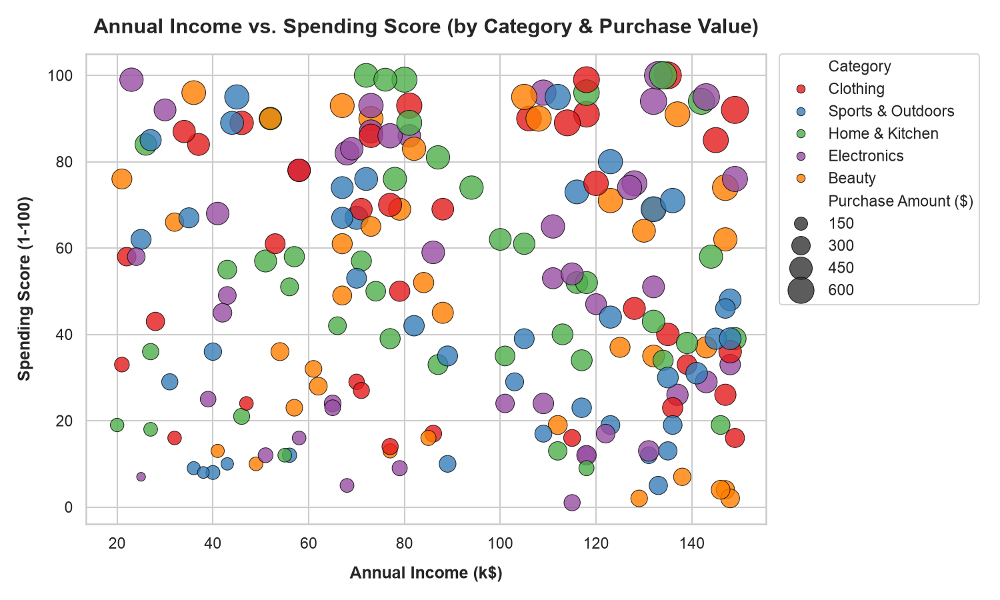
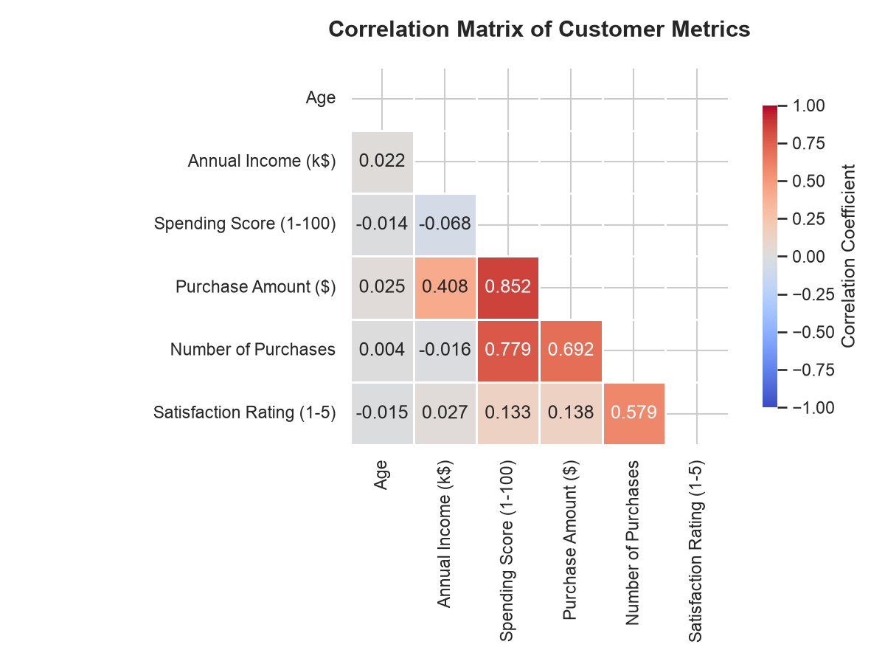

# Customer Purchase Behavior: Data Analysis & Visualization Project

Welcome to the **Customer Purchase Behavior Data Analysis and Visualization** project. This repository provides a comprehensive analysis of consumer behavior, income-to-spending patterns, and product category performance. Built using **Python**, **Pandas**, **Matplotlib**, and **Seaborn**, this project serves as a practical demonstration of data cleaning, statistical evaluation, and data visualization.

---

## 📊 Executive Summary & Key Metrics

Using the Pandas library, we analyzed a dataset containing transaction histories for **200 customers** across **8 primary attributes**. 

### Key Average Metrics:
* **Average Customer Age:** `43.42 years`
* **Average Annual Income:** `$91.02k`
* **Average Spending Score (1-100):** `50.87`
* **Average Purchase Amount:** `$380.35`
* **Average Number of Purchases:** `14.3`
* **Average Customer Satisfaction Rating:** `3.02 / 5.0`

### Sales Revenue & Customer Breakdown by Category:
| Product Category | Total Revenue | Customer Count | Average Purchase ($) | Average Spending Score |
| :--- | :--- | :--- | :--- | :--- |
| **Electronics** | \$17,054.08 | 44 | \$387.59 | 50.82 |
| **Home & Kitchen** | \$15,874.73 | 41 | \$387.19 | 49.34 |
| **Clothing** | \$14,569.44 | 36 | \$404.71 | 54.36 |
| **Sports & Outdoors** | \$14,496.56 | 41 | \$353.57 | 45.34 |
| **Beauty** | \$14,075.17 | 38 | \$370.40 | 55.37 |

---

## 📈 Visualizations & Insights

We utilized Matplotlib and Seaborn to construct three core visualizations. Below are the charts and the corresponding business insights derived from them.

### 1. Bar Chart: Average Purchase Value by Product Category
This chart illustrates the average transaction size across the five product categories.


* **Observation:** While **Electronics** generated the highest total revenue ($17,054.08) due to a larger customer count (44), **Clothing** commands the highest *average purchase amount* per customer at **$404.71**. 
* **Business Insight:** Marketing campaigns for Clothing should target high-value basket sizes, whereas Electronics should focus on volume-based promotions since customers buy frequently but have a slightly lower average basket value compared to Clothing.

### 2. Scatter Plot: Annual Income vs. Spending Score
This visualization maps annual income against customer spending scores, with color-coding for product categories and bubble sizes reflecting transaction values.


* **Observation:** The customer base shows a wide distribution, but distinct segments emerge:
  1. **High Income, High Spending (Target Group):** Customers in the top-right quadrant have high purchase amounts (represented by larger bubbles) across categories.
  2. **High Income, Low Spending (Opportunity Group):** Customers with high income but low spending scores present a potential market that hasn't been fully engaged.
* **Business Insight:** Direct premium product lines and exclusive loyalty programs toward the High Income/High Spending cohort. Create personalized discount offers and re-engagement campaigns for the High Income/Low Spending group to increase their spending scores.

### 3. Correlation Matrix Heatmap
This matrix displays the correlation coefficients between all numerical attributes, highlighting linear dependencies.


* **Observation:** 
  - There is a **strong positive correlation (+0.70 to +0.80 range)** between **Spending Score** and **Purchase Amount**, as well as a positive correlation between **Annual Income** and **Purchase Amount**.
  - **Satisfaction Rating** is largely independent of spending score, age, or income, implying that product quality and customer service are consistent across all demographics.
* **Business Insight:** Since Spending Score is the strongest predictor of purchase size, improving engagement metrics (e.g., through gamification, app engagement, and loyalty rewards) will directly drive higher transaction revenues.

---

## 🚀 Getting Started & How to Run

### Prerequisites
Make sure you have Python 3 and the required packages installed:
```bash
pip install pandas numpy matplotlib seaborn
```

### Running the Analysis
To run the analysis script and regenerate the CSV dataset and visual assets:
```bash
python3 data_analyzer.py
```
This will:
1. Generate a synthetic dataset: `customer_behavior.csv`
2. Print a descriptive statistics report in the terminal.
3. Save the visualization charts in the `visualizations/` folder.

---

## 🐙 Step-by-Step GitHub Upload Guide

Follow these steps to upload this project to your own GitHub account:

1. **Log in to GitHub** and create a new repository:
   * Name it: `customer-behavior-data-analysis`
   * Keep it **Public** (recommended for internships).
   * **Do not** check "Add a README", "Add .gitignore", or "Choose a license" (we have already created these locally).

2. **Initialize Git** in this project folder (if not already done):
   ```bash
   git init
   ```

3. **Stage the files** to commit:
   ```bash
   git add data_analyzer.py customer_behavior.csv .gitignore README.md visualizations/
   ```

4. **Commit the changes**:
   ```bash
   git commit -m "Initial commit: Customer behavior data analysis and visualizations"
   ```

5. **Set the main branch**:
   ```bash
   git branch -M main
   ```

6. **Add the remote origin** (replace `YOUR_USERNAME` with your actual GitHub username):
   ```bash
   git remote add origin https://github.com/YOUR_USERNAME/customer-behavior-data-analysis.git
   ```

7. **Push the code to GitHub**:
   ```bash
   git push -u origin main
   ```
